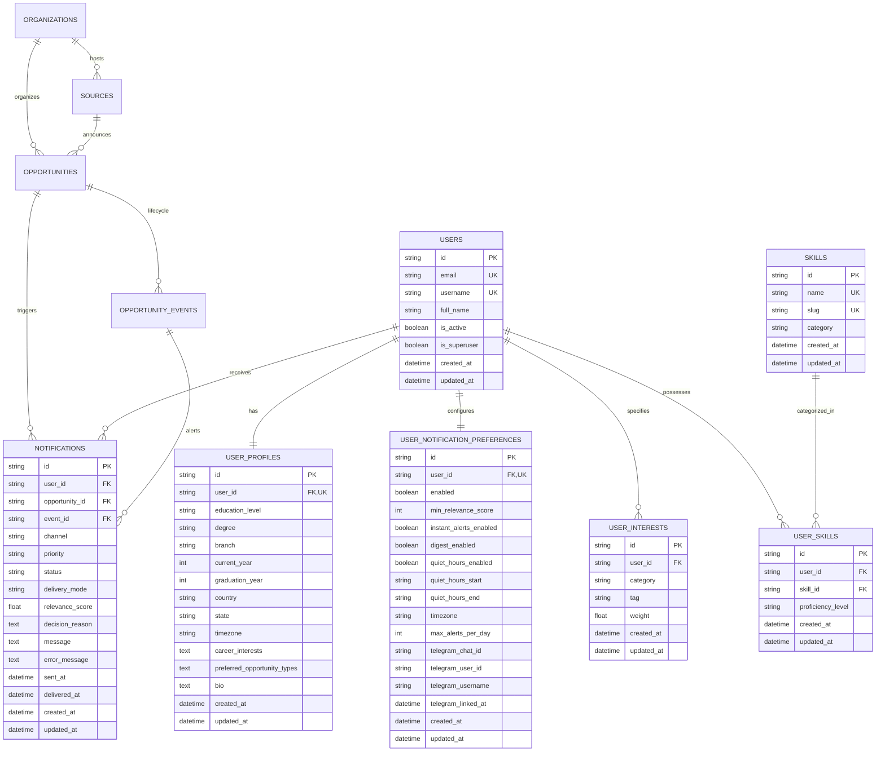

# SIGNAL 📡 — Database Schema & Data Modeling

SIGNAL uses **PostgreSQL** in production with **SQLAlchemy 2.0 (Async)** and **Alembic** for schema migrations. For frictionless local development, the codebase also natively supports SQLite (`aiosqlite`).

---

## 1. Entity-Relationship Diagram

---

## 2. Table Specifications

### 2.1 `organizations`
Represents the sponsoring entity (e.g. TCS, Google, AICTE, MeitY).
* `id` (`VARCHAR(36)`): UUID primary key.
* `name` (`VARCHAR(255)`, NOT NULL, indexed): Display name.
* `slug` (`VARCHAR(255)`, NOT NULL, UNIQUE, indexed): URL-safe slug.
* `website` (`VARCHAR(512)`): Official portal URL.
* `logo_url` (`VARCHAR(512)`): Brand icon/logo.
* `description` (`TEXT`): Organization overview.
* `is_verified` (`BOOLEAN`, default `false`): Verification flag.

### 2.2 `sources`
Monitored feed, website, or API endpoint.
* `id` (`VARCHAR(36)`): UUID primary key.
* `name` (`VARCHAR(255)`, NOT NULL, indexed).
* `slug` (`VARCHAR(255)`, NOT NULL, UNIQUE, indexed).
* `organization_id` (`VARCHAR(36)`, FK `organizations.id`, nullable).
* `category` (`VARCHAR(50)`, NOT NULL, indexed): e.g. `competitive_programming`.
* `source_type` (`VARCHAR(50)`, NOT NULL): `api`, `rss`, `official_website`, `public_feed`.
* `base_url` (`VARCHAR(1024)`, NOT NULL).
* `monitor_frequency_minutes` (`INTEGER`, default `60`): Polling schedule.
* `priority` (`INTEGER`, default `1`): 1 (highest) to 10.
* `trust_level` (`VARCHAR(50)`, default `high`): Trust hierarchy tier.
* `is_active` (`BOOLEAN`, default `true`, indexed).
* `last_polled_at` (`DATETIME WITH TIMEZONE`, nullable).

### 2.3 `opportunities`
Canonical opportunity record.
* `id` (`VARCHAR(36)`): UUID primary key.
* `title` (`VARCHAR(512)`, NOT NULL, indexed): Canonical opportunity title.
* `slug` (`VARCHAR(512)`, NOT NULL, indexed): Slug with hash suffix.
* `organization_id` (`VARCHAR(36)`, FK `organizations.id`, indexed).
* `source_id` (`VARCHAR(36)`, FK `sources.id`, indexed).
* `category` (`VARCHAR(50)`, NOT NULL, indexed): e.g. `hackathon`.
* `event_type` (`VARCHAR(50)`, NOT NULL): `competition`, `challenge`, `internship`.
* `status` (`VARCHAR(50)`, NOT NULL, indexed): `registration_open`, `active`, etc.
* `verification_status` (`VARCHAR(50)`, NOT NULL, indexed): `discovered`, `unverified`, `verified`, `likely_verified`, `conflicting`, `review_required`.
* `confidence_score` (`INTEGER`, default `50`): Extraction & validation confidence (0-100).
* `verification_confidence` (`FLOAT`, default `0.5`): Multi-source verification confidence score (0.0 to 1.0).
* `source_count` (`INTEGER`, default `1`): Number of corroborating sources.
* `official_source_present` (`BOOLEAN`, default `false`): Whether at least one official source has corroborated.
* `last_verified_at` (`DATETIME WITH TIMEZONE`, nullable): Timestamp of latest verification consensus.
* `official` (`BOOLEAN`, default `false`): Host confirmed.
* `eligibility` (`TEXT`): Extracted eligibility requirements.
* `target_audience` (`VARCHAR(255)`): Target persona (e.g. B.Tech CSE students).
* `application_url` (`VARCHAR(1024)`): Direct portal link.
* `raw_content` (`TEXT`): Full unmodified text from source.
* `summary` (`TEXT`): AI-synthesized briefing.
* `content_hash` (`VARCHAR(64)`, indexed): SHA-256 hash for deduplication.

### 2.4 `opportunity_events`
Individual lifecycle milestones linked to an opportunity.
* `id` (`VARCHAR(36)`): UUID primary key.
* `opportunity_id` (`VARCHAR(36)`, FK `opportunities.id`, cascade delete, indexed).
* `event_type` (`VARCHAR(50)`, NOT NULL, indexed): e.g. `registration_closing`.
* `title` (`VARCHAR(255)`, NOT NULL).
* `event_date` (`DATETIME WITH TIMEZONE`, indexed).
* `deadline_date` (`DATETIME WITH TIMEZONE`, indexed).
* `is_critical` (`BOOLEAN`, default `false`): Urgency indicator.

### 2.5 `raw_discoveries`
Immutable audit log of all raw items fetched by connectors prior to downstream filtering and canonicalization.
* `id` (`VARCHAR(36)`): UUID primary key.
* `source_id` (`VARCHAR(36)`, FK `sources.id`, ondelete `SET NULL`, indexed).
* `external_id` (`VARCHAR(255)`, indexed): Source-native unique identifier (contest ID, feed guid, problem ID).
* `original_url` (`VARCHAR(1024)`, NOT NULL): Exact unmodified URL as reported by the source.
* `canonical_url` (`VARCHAR(1024)`, NOT NULL, indexed): Normalized URL stripped of tracking params and fragments.
* `raw_title` (`VARCHAR(512)`, NOT NULL): Unmodified source title.
* `raw_content` (`TEXT`, NOT NULL): Full unmodified payload.
* `published_at` (`DATETIME WITH TIMEZONE`, nullable): Publication or start date reported upstream.
* `fetched_at` (`DATETIME WITH TIMEZONE`, NOT NULL): Timestamp when item was ingested by the connector.
* `content_hash` (`VARCHAR(64)`, NOT NULL, indexed): SHA-256 hash of normalized text for change detection.
* `status` (`VARCHAR(50)`, NOT NULL, indexed): `discovered`, `filtered_out`, `processing`, `processed`, `duplicate`, `failed`.
* `processing_reason` (`TEXT`, nullable): Reason for status transition (filter threshold, AI decision, duplicate match).
* `connector_metadata` (`JSON`, nullable): Source-specific attributes (duration, theme, categories, raw tags).
* `opportunity_id` (`VARCHAR(36)`, FK `opportunities.id`, ondelete `SET NULL`, indexed): Linked canonical opportunity if processed.

### 2.6 `users`, `user_profiles`, `user_interests`
* Normalized user profiles capturing graduation year, degree, branch, and weighted interest tags.

### 2.7 `notifications`
* Audit trail for alerts dispatched across Telegram, Email, and Push with delivery timestamps.

### 2.8 Program Watch Subsystem (Phase 1C-A)

#### `program_watches`
* Primary entity tracking explicitly monitored programs, competitions, and initiatives.
* `id` (`VARCHAR(36)`): UUID primary key.
* `organization_id` (`VARCHAR(36)`, FK `organizations.id`, ondelete `SET NULL`, indexed).
* `name` (`VARCHAR(255)`, indexed): Human-readable name (e.g. `TCS CodeVita`).
* `canonical_name` (`VARCHAR(255)`, indexed): Normalized name token (e.g. `tcs codevita`).
* `description` (`TEXT`, nullable): Background overview.
* `priority` (`VARCHAR(50)`, indexed): `critical`, `high`, `medium`, `low`.
* `is_active` (`BOOLEAN`, default `true`, indexed): Active matching toggle.

#### `program_watch_aliases`
* Exact alternative names and acronyms.
* `id` (`VARCHAR(36)`): UUID primary key.
* `program_watch_id` (`VARCHAR(36)`, FK `program_watches.id`, cascade delete, indexed).
* `alias` (`VARCHAR(255)`), `normalized_alias` (`VARCHAR(255)`, indexed).
* `UNIQUE(program_watch_id, normalized_alias)`.

#### `program_watch_keywords`
* Weighted keywords with distinctiveness guardrails.
* `id` (`VARCHAR(36)`): UUID primary key.
* `program_watch_id` (`VARCHAR(36)`, FK `program_watches.id`, cascade delete, indexed).
* `keyword` (`VARCHAR(255)`), `normalized_keyword` (`VARCHAR(255)`, indexed).
* `weight` (`FLOAT`, 0.0 to 1.0), `is_distinctive` (`BOOLEAN`, default `true`).
* `UNIQUE(program_watch_id, normalized_keyword)`.

#### `program_watch_sources`
* Known official sources or URL patterns associated with a monitored program.
* `id` (`VARCHAR(36)`): UUID primary key.
* `program_watch_id` (`VARCHAR(36)`, FK `program_watches.id`, cascade delete, indexed).
* `source_id` (`VARCHAR(36)`, FK `sources.id`, ondelete `SET NULL`, indexed).
* `url` (`VARCHAR(1024)`, nullable), `priority` (`INTEGER`, default 1), `is_active` (`BOOLEAN`).

#### `program_watch_matches`
* Immutable audit evidence table recording matches between raw discoveries and monitored programs.
* `id` (`VARCHAR(36)`): UUID primary key.
* `program_watch_id` (`VARCHAR(36)`, FK `program_watches.id`, cascade delete, indexed).
* `raw_discovery_id` (`VARCHAR(36)`, FK `raw_discoveries.id`, cascade delete, indexed).
* `match_score` (`FLOAT`, indexed): Evaluated score between 0.0 and 1.0.
* `match_level` (`VARCHAR(50)`, indexed): `exact_alias`, `exact_name`, `exact_canonical_name`, `keyword_combination`, `source_association`.
* `match_reason` (`TEXT`): Human-readable explanation of why the match occurred.
* `matched_terms` (`JSON`): List of specific terms that triggered the match.
* `created_at` (`DATETIME WITH TIMEZONE`, indexed).
* `UNIQUE(program_watch_id, raw_discovery_id)`: Enforces strict idempotency on repeated polling.

### 2.9 Source Intelligence & Change Monitoring (Phase 1C)

#### `source_snapshots`
* Historical point-in-time snapshots of raw and normalized source payloads for semantic change detection.
* `id` (`VARCHAR(36)`): UUID primary key.
* `source_id` (`VARCHAR(36)`, FK `sources.id`, cascade delete, indexed).
* `snapshot_hash` (`VARCHAR(64)`, NOT NULL, indexed): SHA-256 of normalized noise-free text.
* `content_hash` (`VARCHAR(64)`, NOT NULL, indexed): SHA-256 of raw response payload.
* `normalized_content` (`TEXT`, nullable): Normalized text stored for structural comparison.
* `raw_content` (`TEXT`, nullable): Full or truncated raw response snippet.
* `items_count` (`INTEGER`, default 0): Number of extracted items in snapshot.
* `fetched_at` (`DATETIME WITH TIMEZONE`, NOT NULL): Execution timestamp.
* `status` (`VARCHAR(50)`, default `success`): `success`, `changed`, `unchanged`, `error`.
* `change_type` (`VARCHAR(50)`, nullable): `no_change`, `content_changed`, `new_item`, `item_removed`, `deadline_changed`, `status_changed`.
* `metadata_json` (`JSON`, nullable): Fetch duration, response codes, parser versions.

#### `organization_aliases`
* Maps alternative brandings, acronyms, and historical names to canonical organizations.
* `id` (`VARCHAR(36)`): UUID primary key.
* `organization_id` (`VARCHAR(36)`, FK `organizations.id`, cascade delete, indexed).
* `alias` (`VARCHAR(255)`, NOT NULL): Human-readable alternative (e.g. `TCS`, `AICTE`, `Google Open Source`).
* `normalized_alias` (`VARCHAR(255)`, NOT NULL, indexed): Lowercase slugified token for fast lookups.
* `UNIQUE(organization_id, alias)`.

### 2.10 Cross-Source Verification & AI Intelligence (Phase 3)

#### `opportunity_sources`
Tracks multi-source provenance and trust contributions for each opportunity.
* `id` (`VARCHAR(36)`): UUID primary key.
* `opportunity_id` (`VARCHAR(36)`, FK `opportunities.id`, cascade delete, indexed).
* `source_id` (`VARCHAR(36)`, FK `sources.id`, cascade delete, indexed).
* `raw_discovery_id` (`VARCHAR(36)`, FK `raw_discoveries.id`, ondelete `SET NULL`, nullable).
* `source_type` (`VARCHAR(50)`, NOT NULL): `official`, `portal`, `aggregator`, `social`, `community`.
* `trust_score` (`FLOAT`, NOT NULL, default `0.5`): Evaluated source trust score (0.00 to 1.00).
* `is_official` (`BOOLEAN`, default `false`): Whether source is the official sponsor/host.
* `discovered_at` (`DATETIME WITH TIMEZONE`, NOT NULL): First observation timestamp.
* `last_seen_at` (`DATETIME WITH TIMEZONE`, NOT NULL): Most recent observation timestamp.
* `source_url` (`VARCHAR(1024)`, NOT NULL): URL where announcement was observed.
* `extracted_title` (`VARCHAR(512)`, nullable): Title as reported by this source.
* `extracted_deadline` (`DATETIME WITH TIMEZONE`, nullable): Deadline date reported by this source.
* `extracted_status` (`VARCHAR(50)`, nullable): Status reported by this source.
* `UNIQUE(opportunity_id, source_id)`.

#### `verified_fields`
Tracks fact-level consensus for discrete canonical fields (e.g. `title`, `deadline`, `application_url`).
* `id` (`VARCHAR(36)`): UUID primary key.
* `opportunity_id` (`VARCHAR(36)`, FK `opportunities.id`, cascade delete, indexed).
* `field_name` (`VARCHAR(100)`, NOT NULL, indexed): Name of field (`title`, `deadline`, `application_url`, `eligibility`).
* `canonical_value` (`TEXT`, NOT NULL): Agreed canonical value.
* `verification_status` (`VARCHAR(50)`, default `unverified`): `unverified`, `single_source`, `multi_source_verified`, `official_verified`, `conflicting`.
* `confidence_score` (`FLOAT`, default `0.5`): Confidence score (0.0 to 1.0).
* `supporting_sources_count` (`INTEGER`, default `1`): Number of independent confirming sources.
* `conflicting_sources_count` (`INTEGER`, default `0`): Number of sources reporting contradicting facts.
* `last_verified_at` (`DATETIME WITH TIMEZONE`, nullable).
* `verification_method` (`VARCHAR(100)`, nullable): `deterministic_match`, `official_source`, `ai_assisted`, `human_review`.
* `UNIQUE(opportunity_id, field_name)`.

#### `verification_conflicts`
Records discrepancies between sources for auditing and human review.
* `id` (`VARCHAR(36)`): UUID primary key.
* `opportunity_id` (`VARCHAR(36)`, FK `opportunities.id`, cascade delete, indexed).
* `field_name` (`VARCHAR(100)`, NOT NULL, indexed): Field in dispute (`deadline`, `eligibility`, `application_url`).
* `source_a_id` (`VARCHAR(36)`, FK `sources.id`, indexed).
* `source_b_id` (`VARCHAR(36)`, FK `sources.id`, indexed).
* `value_a` (`TEXT`, NOT NULL): Fact reported by Source A.
* `value_b` (`TEXT`, NOT NULL): Fact reported by Source B.
* `conflict_type` (`VARCHAR(50)`, NOT NULL): `deadline_discrepancy`, `url_mismatch`, `eligibility_conflict`, `status_discrepancy`.
* `status` (`VARCHAR(50)`, default `open`): `open`, `auto_resolved`, `human_resolved`, `dismissed`.
* `resolution` (`TEXT`, nullable): Resolution description.
* `resolved_by` (`VARCHAR(100)`, nullable): Resolver identifier (`official_source_rule`, `admin_user`).
* `resolved_at` (`DATETIME WITH TIMEZONE`, nullable).

#### `semantic_match_candidates`
Caches pairwise vector similarities between opportunities or discoveries for deduplication.
* `id` (`VARCHAR(36)`): UUID primary key.
* `opportunity_a_id` (`VARCHAR(36)`, FK `opportunities.id`, cascade delete, indexed).
* `opportunity_b_id` (`VARCHAR(36)`, FK `opportunities.id`, cascade delete, indexed).
* `similarity_score` (`FLOAT`, NOT NULL, indexed): Cosine similarity score (0.0 to 1.0).
* `model_version` (`VARCHAR(100)`, NOT NULL): Embedding model identifier.
* `match_status` (`VARCHAR(50)`, default `candidate`): `candidate`, `confirmed_duplicate`, `confirmed_distinct`, `merged`.
* `evaluated_at` (`DATETIME WITH TIMEZONE`, NOT NULL).

#### `verification_reviews`
Audit queue for human reviewers to resolve ambiguous entity merges or unresolvable conflicts.
* `id` (`VARCHAR(36)`): UUID primary key.
* `opportunity_id` (`VARCHAR(36)`, FK `opportunities.id`, cascade delete, indexed).
* `conflict_id` (`VARCHAR(36)`, FK `verification_conflicts.id`, ondelete `SET NULL`, nullable).
* `candidate_id` (`VARCHAR(36)`, FK `semantic_match_candidates.id`, ondelete `SET NULL`, nullable).
* `review_type` (`VARCHAR(50)`, NOT NULL): `ambiguous_match`, `data_conflict`, `low_confidence`, `merge_candidate`.
* `priority` (`VARCHAR(50)`, default `medium`, indexed): `critical`, `high`, `medium`, `low`.
* `status` (`VARCHAR(50)`, default `pending`, indexed): `pending`, `in_review`, `approved`, `rejected`.
* `assigned_to` (`VARCHAR(255)`, nullable).
* `reviewer_notes` (`TEXT`, nullable).
* `ai_recommendation` (`JSON`, nullable): AI suggested resolution and reasoning.
* `created_at` (`DATETIME WITH TIMEZONE`, indexed).
* `resolved_at` (`DATETIME WITH TIMEZONE`, nullable).

