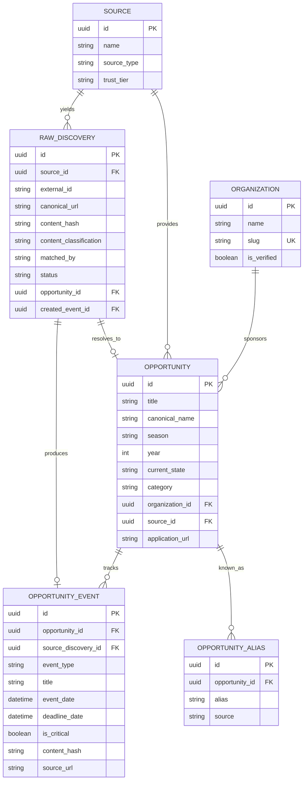
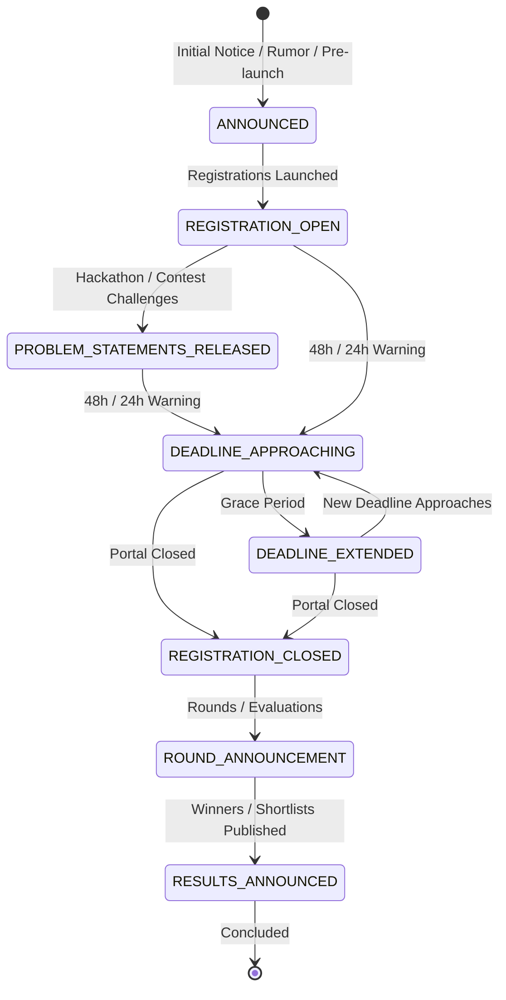

# SIGNAL 📡 — Domain Model & Entity Ontology

## 1. Overview & Vision

SIGNAL distinguishes between what the internet publishes (**Discoveries**), what users act upon (**Opportunities**), and how opportunities evolve over time (**Opportunity Events**).

The system models high-value competitions, student programs, hackathons, scholarships, and internships not as ephemeral news articles, but as **canonical state machines** with rich historical timelines.

---

## 2. Core Entities & Relationships

---

## 3. Distinction of Domain Concepts

### 3.1 Raw Discovery (`RawDiscovery`)
- **What it represents**: An audited record of an announcement, webpage, RSS item, or API payload discovered at a specific timestamp.
- **Role**: Preserves exact raw provenance, original URLs, connector metadata, and content hashes. Every piece of ingested data lives here, even if it is discarded or purely informational.
- **Classification**: Stamped with `ContentClassification` (`opportunity`, `event_update`, `deadline_update`, `result`, `informational`, `irrelevant`).

### 3.2 Canonical Opportunity (`Opportunity`)
- **What it represents**: An actionable, enduring opportunity (e.g. *TCS CodeVita Season 13*, *Smart India Hackathon 2026*, *Google Summer of Code 2026*).
- **Role**: Represents the single authoritative entity across the entire lifecycle. Updates and subsequent announcements do **not** spawn new opportunities; they resolve to this record.
- **Fields**:
  - `canonical_name`: Standardized opportunity base without volatile state words (e.g., `"TCS CodeVita"`).
  - `season`: Distinct season or edition (e.g., `"Season 13"`).
  - `year`: Target operational year (e.g., `2026`).
  - `current_state`: Current lifecycle state (`announced`, `registration_open`, `deadline_extended`, etc.).

### 3.3 Opportunity Event (`OpportunityEvent`)
- **What it represents**: A milestone or state transition in the lifecycle of an opportunity.
- **Role**: Forms an append-only timeline (e.g. "Registration Open", "Problem Statements Released", "Deadline Extended", "Winners Announced").
- **Idempotency**: Strictly deduplicated via `content_hash` and `(opportunity_id, event_type, date)` uniqueness.

### 3.4 Opportunity Alias (`OpportunityAlias`)
- **What it represents**: Alternate names, acronyms, or historical naming variations for a canonical opportunity.
- **Examples**:
  - `GSoC 2026` → Canonical: `Google Summer of Code 2026`
  - `CodeVita 13` → Canonical: `TCS CodeVita Season 13`
  - `SIH 2026` → Canonical: `Smart India Hackathon 2026`

---

## 4. Opportunity Lifecycle State Machine

---

## 5. Non-Opportunity Content Handling (Audited Bypass)

Technical blogs and corporate portals frequently publish items that are **not** opportunities (e.g., incident retrospectives, system maintenance notices, product release notes).

Under SIGNAL:
1. All such items are recorded in `raw_discoveries`.
2. Classified as `informational` or `irrelevant`.
3. Marked as `status = "filtered_out"` with explicit `processing_reason`.
4. **Zero** `Opportunity` and **zero** `OpportunityEvent` records are generated.
