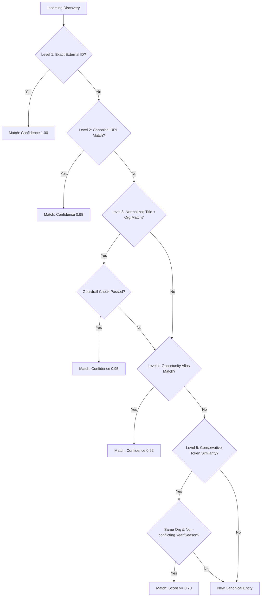

# SIGNAL 📡 — Entity Resolution Architecture

## 1. Objective & Philosophy

Entity resolution in SIGNAL determines whether an incoming raw discovery refers to an **existing canonical opportunity** or represents an **entirely new opportunity**.

In opportunity tracking, false merges are catastrophic:
- If *Smart India Hackathon 2025* is accidentally merged with *Smart India Hackathon 2026*, historical records and dead links corrupt current opportunities.
- If *Google Hackathon* is merged with *Microsoft Hackathon* due to high token overlap, user trust is destroyed.

Therefore, SIGNAL employs a **conservative, multi-tiered deterministic matching hierarchy** with strict false-merge guardrails.

---

## 2. 5-Tier Matching Hierarchy

When an incoming discovery is evaluated against existing canonical opportunities, it passes through 5 descending tiers:

### Tier Details

| Tier | Strategy | Scope | Confidence | Description |
| :--- | :--- | :--- | :--- | :--- |
| **Level 1** | External Identifier | Global / Per Source | **1.00** | Matches source-assigned stable IDs (e.g. Codeforces contest `2261`, SIH problem ID `26001`). |
| **Level 2** | Canonical URL | Normalized URL | **0.98** | Strips tracking query parameters (`utm_*`, `ref`, `fbclid`), trailing slashes, fragments, and schemes. Matches canonical URLs. |
| **Level 3** | Exact Title + Organization | Scoped to Org | **0.95** | Compares normalized alphanumeric title or canonical base name strictly within the same organization. |
| **Level 4** | Known Aliases | Global / Scoped | **0.92** | Looks up explicit nicknames and acronyms in `opportunity_aliases` (e.g. "GSoC 2026" -> "Google Summer of Code 2026"). |
| **Level 5** | Conservative Token Similarity | Scoped to Org | **0.70 - 0.86** | Calculates Jaccard similarity and token containment strictly among opportunities from the **same organization**. |

---

## 3. False-Merge Guardrails

Even if title tokens or URLs suggest a potential match, the resolution engine **aborts** a merge if any of the following guardrails trigger:

1. **Different Organizations**: Opportunities from different organizations are **never** merged at Level 3 or Level 5.
2. **Conflicting Years**: If Opportunity A has `year = 2025` and the incoming item specifies `year = 2026`, resolution strictly rejects the match and spawns a new canonical entity.
3. **Conflicting Seasons/Editions**: If Opportunity A has `season = "12"` and the incoming item specifies `season = "13"`, the match is rejected.
4. **Discriminative Stop Words**: Non-discriminative lifecycle state words (`open`, `extended`, `results`, `registration`, `announced`, `update`) are stripped before computing token intersection to avoid artificial inflation of similarity scores.

---

## 4. Canonical Base Name Extraction

To ensure updates match across the lifecycle, the `DomainClassifier` extracts the invariant base name by stripping transient prefixes and status clauses:

- `"SIH: AI-Based early warning..."` → `"AI-Based early warning..."`
- `"TCS announces CodeVita Season 13"` → `"TCS CodeVita"`
- `"TCS CodeVita Season 13 registrations are open"` → `"TCS CodeVita"`
- `"TCS CodeVita Season 13 deadline extended"` → `"TCS CodeVita"`
- `"TCS CodeVita Season 13 results declared"` → `"TCS CodeVita"`
