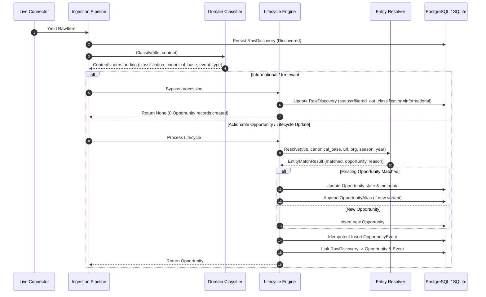

# SIGNAL 📡 — Opportunity Lifecycle Engine

## 1. Overview

The `LifecycleEngine` coordinates the transition from a raw discovery into a tracked, versioned, and auditable opportunity timeline.

It guarantees:
- **Zero spurious opportunities** for informational or non-actionable content.
- **Single canonical opportunity records** for multi-stage announcements (initial notice -> registrations -> deadline extension -> results).
- **Strict event idempotency** across repeated polling intervals.

---

## 2. Ingestion to Lifecycle Flow

---

## 3. Supported Lifecycle Event Types

SIGNAL models the complete opportunity timeline through canonical `EventType` constants:

| Event Type | Critical Flag | Typical Trigger | State Impact |
| :--- | :--- | :--- | :--- |
| `announced` | False | Initial notice, portal teaser | Sets `current_state = announced` |
| `registration_open` | True | Portal accepts applications | Sets `current_state = registration_open` |
| `registration_closed`| False | Applications close | Sets `current_state = registration_closed` |
| `deadline_extended` | True | Deadline lengthened | Sets `current_state = deadline_extended` |
| `problem_statements_released` | True | Hackathon challenges live | Sets `current_state = problem_statements_released` |
| `round_announcement` | False | Round 1 / Finalist schedule | Updates `current_state = round_announcement` |
| `results_announced` | True | Winners or merit lists out | Sets `current_state = results_announced` |

---

## 4. Event Deduplication & Polling Idempotency

When connectors poll every 15–60 minutes, the same announcement or webpage is fetched repeatedly.

The Lifecycle Engine prevents duplicate events using a two-level defense:

1. **Content Hash Match**:
   `hash = sha256(f"{opp.id}:{event_type}:{canonical_url}:{text_hash}")`
   If an event with this exact content hash already exists for the opportunity, creation is skipped.

2. **Temporal Window Match**:
   If an event with the same `(opportunity_id, event_type)` was already recorded on the same calendar day, it is recognized as a duplicate and skipped.

Audit findings confirm that repeated polling runs result in **0 new opportunities** and **0 duplicate events**.
