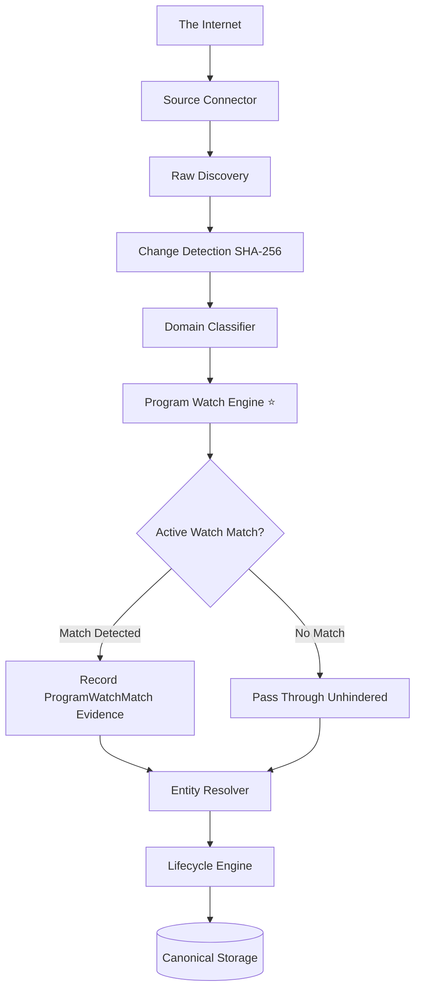
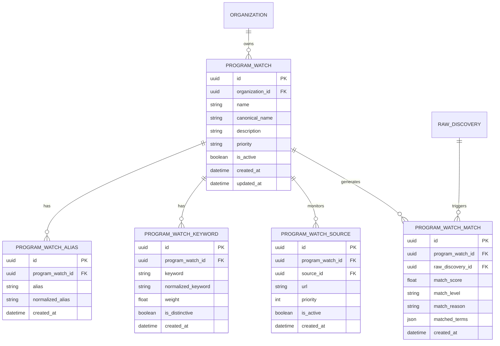
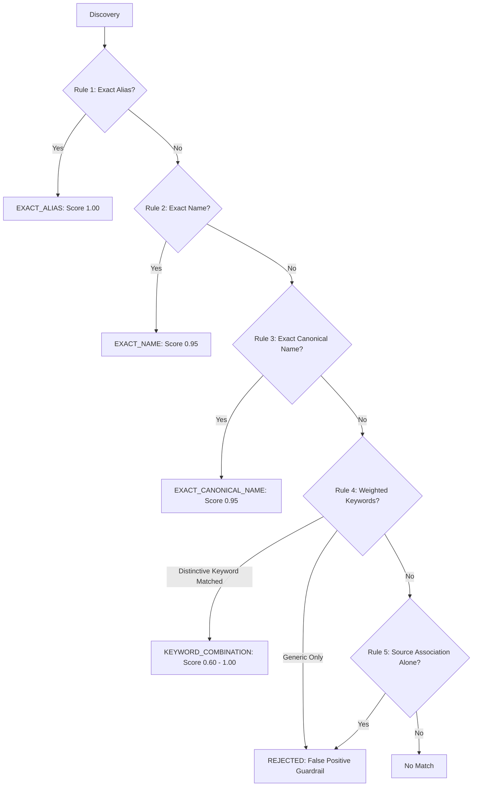

# SIGNAL 📡 — Program Watch Engine & Watch Registry

## 1. Overview & Purpose

The **Program Watch Engine** is SIGNAL's proactive intelligence layer designed to actively monitor flagship programs, competitions, hackathons, and student initiatives.

While the standard pipeline discovers arbitrary opportunities on the internet, the Program Watch Engine ensures that **explicitly monitored programs** (such as *TCS CodeVita*, *Google Summer of Code*, *Smart India Hackathon*, *Flipkart GRiD*) are immediately recognized, matched, scored, and attributed with transparent evidence.

---

## 2. Core Architecture

### Key Principles
1. **Separation of Concerns**:
   - `RawDiscovery`: What was discovered on the internet.
   - `ProgramWatch`: What SIGNAL was instructed to monitor.
   - `ProgramWatchMatch`: Evidence linking a discovery to a monitored program.
   - `Opportunity`: The canonical actionable entity.
   - `OpportunityEvent`: Lifecycle updates for that opportunity.
2. **Non-Blocking Execution**: Monitored programs receive immediate priority attribution; unmonitored discoveries continue through normal opportunity and lifecycle ingestion.
3. **Zero AI Cost**: Operates entirely with fast, deterministic, explainable rule matching.

---

## 3. Database Schema

The Program Watch subsystem comprises five normalized tables:

### Table Descriptions
1. `program_watches`: Primary entity tracking program metadata, priority tier (`CRITICAL`, `HIGH`, `MEDIUM`, `LOW`), and active state (`is_active`).
2. `program_watch_aliases`: Exact nicknames and acronyms (e.g. `GSoC`, `SIH 2026`, `CodeVita`). Enforces `UNIQUE(program_watch_id, normalized_alias)`.
3. `program_watch_keywords`: Weighted keywords with `is_distinctive` flags to separate high-value signals from generic terminology. Enforces `UNIQUE(program_watch_id, normalized_keyword)`.
4. `program_watch_sources`: Associates monitored programs with known official sources or URL patterns.
5. `program_watch_matches`: Immutable audit evidence table capturing match score, level, reason, and matched terms. Enforces `UNIQUE(program_watch_id, raw_discovery_id)`.

---

## 4. Matching Strategy & Levels

The `ProgramWatchMatcher` evaluates incoming discoveries through five distinct rules:

### Evaluation Hierarchy
| Level | Confidence | Score Range | Description |
| :--- | :--- | :--- | :--- |
| `EXACT_ALIAS` | HIGH | **1.00** (Title) / **0.92** (Content) | Whole-word boundary regex match on configured alias (`\b{alias}\b`). |
| `EXACT_NAME` | HIGH | **0.95** | Exact whole-word match on official program name. |
| `EXACT_CANONICAL_NAME` | HIGH | **0.95** | Exact match on normalized canonical base name. |
| `KEYWORD_COMBINATION` | MEDIUM to HIGH | **0.60 – 1.00** | Weighted combination of keywords requiring at least one distinctive keyword. |
| `SOURCE_ASSOCIATION` | N/A (Supporting) | **+0.15 boost** | Supporting evidence when paired with keywords; never triggers match alone. |

---

## 5. False-Positive Protection

In opportunity tracking, false matches destroy alert credibility:
* **The Problem**: A title like `"TCS announces a new programming competition"` contains `"TCS"`, `"programming"`, and `"competition"`.
* **Guardrail Enforcement**:
  - Keywords are classified into **Distinctive** (`is_distinctive=True`, e.g. `CodeVita`, `GRiD`) vs. **Generic** (`is_distinctive=False`, e.g. `competition`, `challenge`, `programming`).
  - The matcher strictly requires **at least one distinctive keyword** to trigger a `KEYWORD_COMBINATION` match.
  - Generic keywords alone are capped at $< 0.40$ and return `matched = False`.
  - Source association alone returns `matched = False`.

---

## 6. Polling Idempotency & Inactive Watch Handling

1. **Idempotency**: The `ProgramWatchEngine` checks for existing matches on `(program_watch_id, raw_discovery_id)` before persisting. Repeated discovery evaluations create **zero duplicate rows**.
2. **Inactive Watch Exclusion**: Watches with `is_active = False` are excluded at query time (`SELECT ... WHERE is_active = true`) and immediately rejected by the matcher with score 0.0.

---

## 7. Seed Registry (Curated 15 Programs)

Executing `python scripts/seed_program_watches.py` seeds the initial curated registry:

| Priority | Program Name | Organization | Key Aliases / Distinctive Keywords |
| :--- | :--- | :--- | :--- |
| 🔴 **CRITICAL** | **Smart India Hackathon** | Government of India / SIH | `SIH`, `Smart India Hackathon`, `SIH 2026` |
| 🔴 **CRITICAL** | **TCS CodeVita** | TCS | `CodeVita`, `TCS CodeVita`, `Campus Commune` |
| 🔴 **CRITICAL** | **Google Summer of Code** | Google | `GSoC`, `Google Summer of Code`, `Summer of Code` |
| 🔴 **CRITICAL** | **HackWithInfy** | Infosys | `HackWithInfy`, `Hack With Infy` |
| 🔴 **CRITICAL** | **Flipkart GRiD** | Flipkart | `Flipkart GRiD`, `GRiD 6.0`, `GRiD 7.0` |
| 🔴 **CRITICAL** | **Microsoft Imagine Cup** | Microsoft | `Imagine Cup`, `Microsoft Imagine Cup` |
| 🟠 **HIGH** | **Google Solution Challenge** | Google | `Solution Challenge`, `GDSC Solution Challenge` |
| 🟠 **HIGH** | **Amazon ML Challenge** | Amazon | `Amazon ML Challenge`, `Amazon ML` |
| 🟠 **HIGH** | **Kaggle Competitions** | Kaggle | `Kaggle`, `Kaggle Competitions` |
| 🟠 **HIGH** | **HackerRank Competitions** | HackerRank | `HackerRank`, `HackerRank Contest` |
| 🟠 **HIGH** | **HackerEarth Challenges** | HackerEarth | `HackerEarth`, `HackerEarth Challenge` |
| 🟠 **HIGH** | **CodeChef Starters** | CodeChef | `CodeChef Starters`, `Starters` |
| 🟢 **MEDIUM** | **Codeforces Contests** | Codeforces | `Codeforces Round`, `Codeforces Contest` |
| 🟢 **MEDIUM** | **AtCoder Contests** | AtCoder | `AtCoder Beginner Contest`, `ABC` |
| 🟢 **MEDIUM** | **Major League Hacking (MLH)**| Major League Hacking | `MLH`, `Major League Hacking` |
