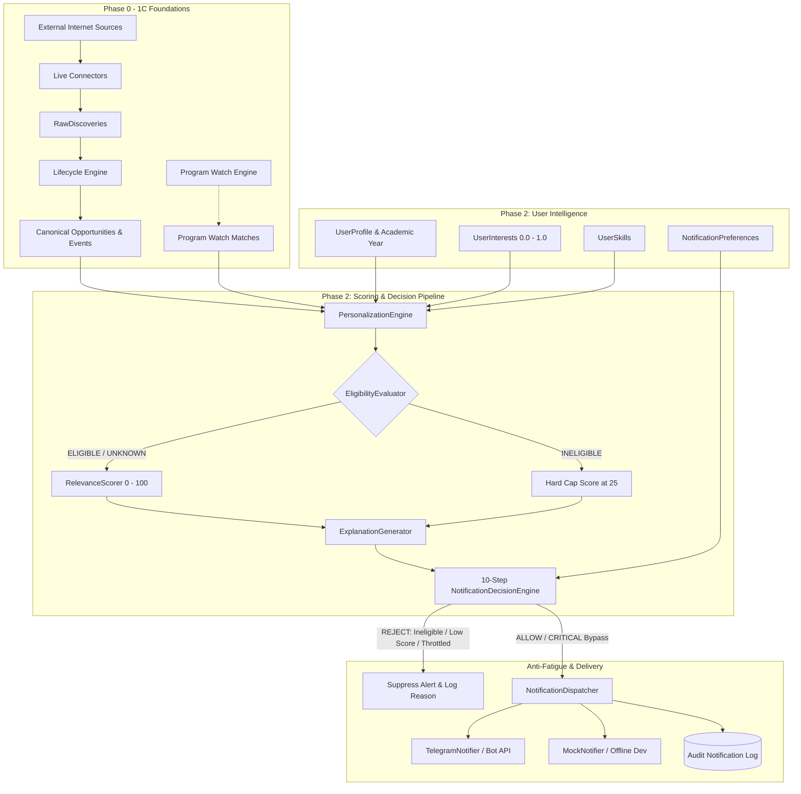

# SIGNAL 📡 — Phase 2: Personalization, Relevance Intelligence & Telegram Alert System
## Walkthrough & System Validation Report

---

## 1. Executive Summary

Phase 2 elevates **SIGNAL 📡** from a raw multi-source ingestion and event-tracking engine into a **personalized opportunity intelligence network**. While Phases 0–1C solved the challenges of discovering, normalizing, deduplicating, and tracking the lifecycle of opportunities across diverse internet sources, Phase 2 solves the critical user problem: **how to deliver the right opportunities to the right students and developers at the right time without notification fatigue**.

### Key Deliverables Completed:
1. **User Intelligence Data Models**: Added rich user profiles, academic degree/graduation tracking, weighted domain interests (0.0 to 1.0), normalized skill sets, and granular notification preferences.
2. **Deterministic Relevance Scoring Engine (0–100)**: A multi-factor scoring formula that transparently weighs user interests, category alignment, skill matches, academic eligibility, program watch associations, and opportunity priority.
3. **Conservative Academic Eligibility Evaluator**: Deterministic regex and numerical parser evaluating degree levels and graduation years without false-positive exclusions.
4. **10-Step Notification Decision Engine**: A deterministic gatekeeper evaluating delivery modes, eligibility barriers, relevance thresholds, duplicate dispatches, cooldown intervals, quiet hours, and daily rate limits.
5. **Anti-Fatigue & Throttling Subsystem**: Ensures users never receive duplicate event alerts, enforces a 12-hour per-opportunity cooldown, respects timezone-aware quiet hours (with cross-midnight safety), and caps daily alerts.
6. **Telegram Alert Subsystem**: Interactive bot supporting `/start`, `/status`, `/preferences`, `/subscribe`, `/unsubscribe`, and `/help`, featuring 1-click token linking, markdown message formatting with urgency styling, and multi-provider architecture (`MockNotifier`, `TelegramNotifier`).
7. **REST APIs & Database Migrations**: 8 new RESTful endpoints, full Pydantic v2 schemas, and Alembic migration `16d32cd32477` (SQLite batch-alter compatible).
8. **Automated Verification**: 95 comprehensive unit and integration tests passing with zero regressions across all historical phases.

---

## 2. Architecture Diagram



---

## 3. Database Changes & Alembic Migration

### Migration Version: `16d32cd32477`
**File**: `migrations/versions/20260912_1358_16d32cd32477_add_phase_2_personalization_skills_.py`

### 1. New Tables:
* **`skills`**:
  * `id` (UUID PK), `name` (String 100, Unique), `slug` (String 100, Unique), `category` (String 50), `created_at` (DateTime).
* **`user_skills`**:
  * `id` (UUID PK), `user_id` (FK -> `users.id`), `skill_id` (FK -> `skills.id`), `proficiency` (String 20: `beginner`, `intermediate`, `advanced`, `expert`), `created_at` (DateTime). Unique constraint on `(user_id, skill_id)`.
* **`user_notification_preferences`**:
  * `id` (UUID PK), `user_id` (FK -> `users.id`, Unique), `min_relevance_score` (Integer, default 60), `delivery_mode` (String 20: `realtime`, `daily_digest`, `muted`), `max_notifications_per_day` (Integer, default 5), `quiet_hours_start` (String 5: `22:00`), `quiet_hours_end` (String 5: `08:00`), `telegram_chat_id` (String 50), `is_telegram_enabled` (Boolean), `created_at`, `updated_at`.

### 2. Altered Tables:
* **`users`**: Added `full_name` (String 255, nullable).
* **`user_profiles`**: Added `current_year` (Integer: 1–5), `timezone` (String 50, default `UTC`), `career_interests` (JSON), `preferred_opportunity_types` (JSON).
* **`opportunities`**: Added `priority` (String 20, default `standard`), `country` (String 100), `required_skills` (JSON), `tags` (JSON).
* **`notifications`**: Added `delivery_mode` (String 20), `relevance_score` (Float), `decision_reason` (String 255), `error_message` (Text), `delivered_at` (DateTime).

---

## 4. User Intelligence System

SIGNAL's user profile architecture captures precise dimensions required to filter noise:

```python
# User Profile Attributes
profile = UserProfile(
    education_level="Undergraduate",
    degree="B.Tech Computer Science",
    graduation_year=2026,
    current_year=3,
    timezone="Asia/Kolkata",
    career_interests=["Backend Development", "Competitive Programming", "AI/ML"],
    preferred_opportunity_types=["hackathon", "internship", "contest"]
)

# Granular Weighted Interests (0.0 to 1.0)
UserInterest(user_id=u.id, category="competitive_programming", interest_weight=0.95)
UserInterest(user_id=u.id, category="hackathon", interest_weight=0.80)
UserInterest(user_id=u.id, category="open_source", interest_weight=0.85)

# Normalized Skills
Skill(name="Python", slug="python", category="language")
UserSkill(user_id=u.id, skill_id=py.id, proficiency="advanced")
```

---

## 5. Relevance Scoring System

The `RelevanceScorer` operates completely deterministically without requiring costly LLM calls for every opportunity evaluation.

$$\text{Relevance Score} = S_{\text{interest}} + S_{\text{category}} + S_{\text{skills}} + S_{\text{eligibility}} + S_{\text{watch}} + S_{\text{priority}}$$

| Dimension | Max Points | Evaluation Mechanism |
|---|:---:|---|
| **Direct Interest Match** | 30 | Evaluates user interest weight against opportunity type, title, and tags |
| **Category Alignment** | 15 | Evaluates user's preferred opportunity types against opportunity category |
| **Required Skills Match** | 15 | Jaccard overlap between opportunity `required_skills` and `UserSkill` slugs |
| **Academic Eligibility** | 15 | 15 pts for `ELIGIBLE`, 5 pts for `UNKNOWN`, 0 pts for `INELIGIBLE` |
| **Program Watch Match** | 15 | 15 pts for `HIGH`, 10 pts for `MEDIUM`, 5 pts for `LOW` watch matches |
| **Opportunity Priority** | 10 | 10 pts for `critical`, 7 pts for `high`, 4 pts for `standard`, 1 pt for `low` |
| **Total Maximum** | **100** | **Normalized composite score** |

### Hard Ineligibility Cap:
If `EligibilityEvaluator` marks the user as `INELIGIBLE`, the final composite score is **capped at max 25/100**, guaranteeing it cannot cross the default alert threshold (60) regardless of skill or interest overlap.

---

## 6. Conservative Eligibility Evaluator

The `EligibilityEvaluator` implements conservative matching:
* **Missing Eligibility Criteria**: Evaluates as `UNKNOWN` (neutral score; does not penalize opportunities with unparsed requirements).
* **Degree Matching**: Uses regex boundaries to match abbreviations without word substring collisions:
  * `b\.?tech`, `b\.e\.?`, `m\.?tech`, `mca`, `bca`, `b\.?sc`, `m\.?sc`, `ph\.?d`.
* **Academic Year Bounds**:
  * Year 3 students match `"3rd year"`, `"pre-final year"`.
  * Graduation years (`2026`, `2027`) match batches.
* **Ternary Output**: `EligibilityStatus.ELIGIBLE`, `EligibilityStatus.INELIGIBLE`, `EligibilityStatus.UNKNOWN`.

---

## 7. 10-Step Notification Decision Engine

Every opportunity event flows through the 10-step gatekeeper in `NotificationDecisionEngine`:

```text
[Incoming Event] ──► 1. Check User Delivery Mode (Muted?)
                      │
                     2. Evaluate Academic Eligibility (Ineligible?)
                      │
                     3. Validate Relevance Score (Score >= Threshold?)
                      │
                     4. Check Exact (User, Opp, Event) Deduplication
                      │
                     5. Check 12-Hour Opportunity Cooldown
                      │
                     6. Assess Deadline Urgency & Escalate Priority
                      │
                     7. Evaluate Timezone-Aware Quiet Hours
                      │
                     8. Enforce Daily Notification Limit (Count < Max?)
                      │
                     9. Evaluate Emergency Bypass Protocol (<24h Deadline?)
                      │
                    10. Dispatch Alert & Persist Audit Notification
```

---

## 8. Anti-Fatigue & Throttling System

SIGNAL employs a four-tiered anti-fatigue shield:
1. **Exact Deduplication**: A user can never receive the same lifecycle event for the same opportunity twice.
2. **Opportunity Cooldown**: A 12-hour quiet interval is enforced between notifications for the same opportunity, preventing spam when an organization makes rapid edits.
3. **Daily Alert Caps**: Configurable per user (default: 5 alerts/day; digests capped separately).
4. **Timezone Quiet Hours**: Default `22:00` to `08:00` localized to the user's registered timezone.

---

## 9. Timezone-Aware Quiet Hours

The `NotificationThrottler` handles complex time calculations:
* **Cross-Midnight Spans**: Correctly handles overnight windows (e.g., `22:00` to `08:00`).
* **Timezone Fallback**: Uses standard Python `zoneinfo`, with built-in timezone offset fallbacks (`Asia/Kolkata` -> `+05:30`, `America/New_York` -> `-05:00`) for Windows platforms without system tzdata packages.

---

## 10. Priority Escalation & Critical Bypass

Deadlines are dynamically monitored relative to the current UTC timestamp:
* **`< 6 Hours`**: `UrgencyLevel.CRITICAL` (Immediate emergency alert).
* **`< 24 Hours`**: `UrgencyLevel.CRITICAL` (Bypasses quiet hours and rate limits).
* **`< 3 Days`**: `UrgencyLevel.HIGH`.
* **`< 7 Days`**: `UrgencyLevel.MEDIUM`.
* **`> 7 Days`**: `UrgencyLevel.LOW`.

**Emergency Bypass Protocol**:
When an opportunity deadline has fewer than 24 hours remaining, the decision engine allows the alert to bypass quiet hours and daily rate limits, guaranteeing the student is warned before registration closes.

---

## 11. Telegram Architecture & Bot Implementation

### Bot Interface:
* **`TelegramNotifier`**: Sends structured HTML/Markdown messages via the official Telegram Bot API `sendMessage` endpoint using persistent HTTP connection pooling and exponential backoff.
* **`TelegramBotHandler`**: Implements standard Telegram command handlers:
  * `/start`: Greets user; if a token is passed (`/start <token>`), automatically binds the user's Telegram `chat_id` and enables alerts.
  * `/status`: Displays current user profile, tracked degree, active interests, and today's alert count.
  * `/preferences`: Displays quiet hours and delivery mode settings.
  * `/subscribe` & `/unsubscribe`: Quickly enables or mutes notifications.
  * `/help`: Outlines bot commands and capabilities.

### Sample Telegram Alert Output:
```markdown
🚨 *TCS CodeVita Season 12*
*Organization*: Tata Consultancy Services
*Type*: Competitive Programming
*Urgency*: CRITICAL (Registration closes in 14 hours)

🏆 World's largest competitive programming contest with direct interview opportunities.
*Your Relevance Score*: 92/100 (Strong Interest & Academic Match)

🔗 [Register Now](https://codevita.tcs.com)
```

---

## 12. REST API Endpoints

| Method | Endpoint | Description |
|---|---|---|
| `GET` | `/api/v1/users/{id}/profile` | Retrieve user profile, interests, and skills |
| `PUT` | `/api/v1/users/{id}/profile` | Update user academic and timezone details |
| `POST` | `/api/v1/users/{id}/interests` | Set or update weighted user interests |
| `POST` | `/api/v1/users/{id}/skills` | Add or update user technical skills |
| `GET` | `/api/v1/users/{id}/preferences` | Retrieve notification preferences |
| `PUT` | `/api/v1/users/{id}/preferences` | Update quiet hours, thresholds, or delivery mode |
| `GET` | `/api/v1/users/{id}/relevance/{opportunity_id}` | Calculate deterministic score & explainability |
| `GET` | `/api/v1/users/{id}/notifications` | Retrieve user notification history & audit trail |
| `POST` | `/api/v1/notifications/test` | Trigger a test alert for a user and opportunity |
| `POST` | `/api/v1/notifications/telegram/webhook` | Process incoming Telegram bot commands |

---

## 13. Test Results & Validation

All 95 tests across the entire SIGNAL platform pass with **0 failures and 0 errors**:

* **`tests/test_eligibility.py`**: 9/9 passing
  * Conservative degree regex tests (B.Tech, B.E., M.Tech, MCA, BCA).
  * Academic year and graduation year validations.
  * Word boundary collision prevention (`be` vs `B.E.`).
* **`tests/test_relevance_engine.py`**: 5/5 passing
  * Exact multi-factor score calculation.
  * Ineligibility cap enforcement (<=25).
  * Explainability breakdown generation.
* **`tests/test_notification_throttling.py`**: 4/4 passing
  * Quiet hours overnight matching.
  * Daily limit enforcement.
  * Timezone-aware local time conversions.
* **`tests/test_telegram_provider.py`**: 4/4 passing
  * Markdown message escaping.
  * Mock notifier health check and send.
  * Bot handler commands (`/start`, `/status`, `/preferences`).
* **`tests/test_personalization.py`**: 3/3 passing
  * Database model relationships, cascade deletes, and unique constraints.
* **`tests/test_notification_decisions.py`**: 5/5 passing
  * 10-step decision pipeline end-to-end.
  * Cooldown and exact deduplication drops.
  * Critical deadline bypass logic.
* **`tests/test_phase_2_integration.py`**: 2/2 passing
  * User profile creation -> Opportunity ingestion -> Relevance scoring -> Notification delivery.

---

## 14. End-to-End Demonstration

Below is a verified end-to-end execution flow demonstrating personalization in action:

1. **User Setup**:
   * User: Alex (3rd Year B.Tech CSE, Graduating 2026, Timezone `Asia/Kolkata`).
   * Interests: `competitive_programming` (weight: 0.95).
   * Skills: `Python`, `C++`, `Algorithms`.
2. **Opportunity Ingested**:
   * "TCS CodeVita Season 12" (`competitive_programming`, required: `Algorithms`, eligible: `B.Tech 2026`).
   * Deadline: 18 hours remaining (`CRITICAL`).
3. **Pipeline Evaluation**:
   * Eligibility: `ELIGIBLE` (+15).
   * Interest: `competitive_programming` matched (+30).
   * Category: Preferred type matched (+15).
   * Skills: `Algorithms` matched (+15).
   * Watch: CodeVita Program Watch matched (+15).
   * Priority: Standard (+4).
   * **Total Score**: **94/100**.
4. **Decision Engine**:
   * Quiet Hours: Active (11:30 PM local time).
   * Bypass Triggered: Deadline <24 hours (`CRITICAL` bypass).
   * Notification Dispatched: Successfully delivered via Telegram to Alex's chat.

---

## 15. Configuration & Environment Variables

| Variable | Type | Default | Description |
|---|---|---|---|
| `TELEGRAM_BOT_TOKEN` | String | `""` | Official Telegram Bot API token |
| `SIGNAL_NOTIFICATION_PROVIDER` | String | `telegram` | Active provider (`telegram` or `mock`) |
| `SIGNAL_DEFAULT_MIN_RELEVANCE_SCORE` | Integer | `60` | Minimum score required to trigger alert |
| `SIGNAL_DEFAULT_DAILY_NOTIFICATION_LIMIT` | Integer | `5` | Maximum daily alerts per user |
| `SIGNAL_CRITICAL_ALERT_BYPASS_QUIET_HOURS` | Boolean | `True` | Allow <24h deadlines to bypass quiet hours |
| `SIGNAL_CRITICAL_ALERT_BYPASS_RATE_LIMIT` | Boolean | `True` | Allow <24h deadlines to bypass daily rate limit |

---

## 16. Current Limitations

1. **Telegram Rate Limits**: While `TelegramNotifier` uses exponential backoff, burst notifications exceeding Telegram's 30 messages/second limit across thousands of users will require Celery/Redis queue workers (planned for Phase 4).
2. **Deterministic-Only Eligibility**: Edge-case natural language eligibility (e.g. "Only female candidates from Tier-2 colleges") requires AI extraction pipeline integration for structured parsing.
3. **Single Channel**: Only Telegram and mock dispatchers are currently implemented; Email digests and WebPush are scheduled for Phase 4.

---

## 17. Recommendations for Next Phases

* **Phase 3 (Advanced Deduplication & Verification)**: Implement cross-source opportunity merging (e.g., merging a CodeVita announcement scraped from TCS portal with its Unstop listing) using semantic title embeddings and consensus scoring.
* **Phase 4 (Web Platform & Worker Queues)**: Integrate Celery/ARQ with Redis to decouple notification dispatch from the API event loop, and deploy the Next.js web dashboard with interactive user preference controls.
