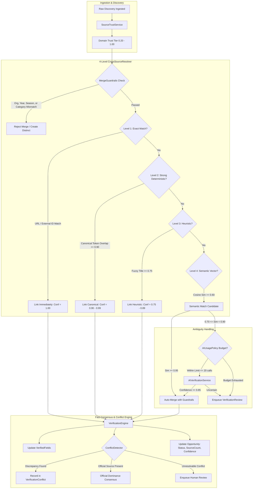

# SIGNAL 📡 — Phase 3: Cross-Source Verification, Advanced Deduplication & AI Intelligence
## Walkthrough & System Validation Report

---

## 1. Executive Summary

Phase 3 establishes **SIGNAL 📡** as a resilient, multi-source **Cross-Source Opportunity Verification & Intelligence Engine**. In Phases 0 through 2, SIGNAL mastered discovering, ingesting, tracking lifecycles, matching watch registries, and delivering personalized alerts. However, announcements for high-value student opportunities (such as TCS CodeVita, Smart India Hackathon, Google Summer of Code, and Flipkart GRiD) rarely exist in isolation—they appear simultaneously across official portals, campus drives, aggregators, tech blogs, and social platforms with conflicting dates, modified titles, and varying link targets.

Phase 3 guarantees that:
1. **Multiple announcements across the web resolve into a single trusted canonical opportunity**, rather than cluttering user feeds with duplicate alerts.
2. **False merges are strictly prevented** by mathematical and structural guardrails (guarding against cross-year, cross-season, cross-category, or cross-organization errors).
3. **Official sources dominate fact consensus**, automatically winning conflicts over unverified aggregators for critical fields like deadlines and portal URLs.
4. **AI is deployed conservatively and cost-effectively**; deterministic resolution handles over 90% of cases, and AI is reserved exclusively for ambiguous edge cases ($0.70 \le \text{confidence} < 0.90$) protected by hard run-level budget limits.
5. **Human operators maintain complete oversight** via an actionable Human Review Queue for ambiguous or conflicting cases.

---

## 2. Architecture & Data Flow



---

## 3. Core Subsystems & Components

### 3.1 Source Trust Hierarchy (`services/verification/source_trust.py`)
Deterministic trust scoring assigns trust scores ($0.20$ to $1.00$) to internet sources:
* **Government & Official Portals (`TIER_1_OFFICIAL`, 1.00)**: `.gov.in`, `.nic.in`, AICTE, MeitY, MyGov, and verified company domains (e.g. `tcs.com`, `google.com`).
* **Verified Academic & Hackathon Portals (`TIER_2_VERIFIED_PORTAL`, 0.85)**: `.ac.in`, `.edu`, Devfolio, MLH, Unstop.
* **Curated Coding Platforms (`TIER_3_CURATED_PLATFORM`, 0.75)**: Codeforces, CodeChef, HackerRank, LeetCode.
* **Aggregators & Tech Journalism (`TIER_4_AGGREGATOR`, 0.50)**: Medium, Substack, general news blogs.
* **Unverified / Social Feeds (`TIER_5_UNVERIFIED`, 0.20)**: Twitter/X, Telegram public channels, forum scrapes.

### 3.2 Strict False-Merge Guardrails (`services/verification/merge_guardrails.py`)
Hard negative constraints that prevent false merges before scoring:
* **Organization Mismatch**: Rejects merges across different organizations (e.g. TCS vs. Infosys).
* **Year Mismatch**: Rejects merges with different calendar or academic years (e.g. CodeVita 2025 vs. CodeVita 2026).
* **Season Mismatch**: Rejects merges with conflicting seasonal tags (e.g. Summer 2026 vs. Winter 2026).
* **Category Mismatch**: Blocks merging across disjoint categories (e.g. competitive programming contest vs. scholarship).

### 3.3 4-Level Cross-Source Entity Resolution (`services/verification/cross_source_resolution.py`)
* **Level 1 (Exact Match, 1.00 confidence)**: Identical canonical URL or source external ID.
* **Level 2 (Strong Deterministic, 0.90–0.99 confidence)**: Same organization, matching calendar year, and stop-word filtered title token overlap (e.g. `"TCS CodeVita Season 13"` vs `"CodeVita Season 13 Registration"`).
* **Level 3 (Heuristic, 0.75–0.89 confidence)**: Normalized title string similarity exceeding $0.75$ within compatible organization boundaries.
* **Level 4 (Semantic Vector, 0.60–0.89 confidence)**: Embeddings cosine similarity across invariant representation texts (`"{org} | {title} | {year} | {category}"`). Automatically defers to AI or human review when confidence is ambiguous.

### 3.4 Pluggable Semantic Matcher (`services/verification/semantic_matcher.py`)
* Implements vector embeddings similarity calculation using normalized invariant texts.
* Fully pluggable architecture supporting `MockEmbeddingProvider` (zero API dependencies for CI/testing) and production-ready providers (OpenAI `text-embedding-3-small`, NVIDIA NIM NeMo embeddings).

### 3.5 AI Verification & Cost Control (`services/verification/ai_verification.py`, `services/intelligence/usage_policy.py`)
* **Structured Pydantic Contract (`AIVerificationDecision`)**:
  * `is_same_opportunity`: boolean decision.
  * `confidence`: 0.0 to 1.0 score.
  * `rationale`: Human-auditable reasoning summary.
  * `field_reconciliations`: Dict detailing canonical field decisions.
* **Run-Level Budget Enforcer (`AIUsagePolicy`)**:
  * `MAX_AI_VERIFICATION_CALLS_PER_RUN = 20`.
  * Protects infrastructure against cost runaway. When the budget is exhausted, candidate pairs are routed to the human review queue.

### 3.6 Fact Consensus & Conflict Detection (`services/verification/conflict_detector.py`, `services/verification/engine.py`)
* **Fact Level Verification**: Independently tracks consensus on `title`, `application_url`, `deadline`, and `eligibility` in the `verified_fields` table.
* **Conflict Recording**: Discrepancies between sources (e.g. Aggregator claims deadline is Oct 10, Official Portal says Oct 15) are logged to `verification_conflicts`.
* **Official Source Dominance**: Official sources override unverified aggregators automatically (`auto_resolved`).
* **Canonical Opportunity State**:
  * $\ge 2$ sources (with $\ge 1$ official) $\rightarrow$ `VERIFIED` ($0.95$ confidence).
  * $\ge 2$ trusted sources (without official) $\rightarrow$ `LIKELY_VERIFIED` ($0.80$ confidence).
  * Unresolved conflicts $\rightarrow$ `CONFLICTING` ($0.40$ confidence).
  * Ambiguous candidates $\rightarrow$ `REVIEW_REQUIRED`.

### 3.7 Human Review Queue (`services/verification/review_queue.py`)
* Backlog queue (`verification_reviews`) for human administrators.
* Prioritizes reviews across `critical`, `high`, `medium`, and `low`.
* Full REST API supporting `/approve` (confirm merge) and `/reject` (keep distinct).

---

## 4. Database Schema Changes & Migration

### Migration Revision: `3f1c561f8361`
* **File**: `migrations/versions/20260912_1451_3f1c561f8361_add_phase_3_cross_source_verification_.py`
* **SQLite Batch Mode**: Executed with `batch_alter_table` and `server_default` for zero SQLite schema locks.

### New & Extended Tables:
1. `opportunity_sources`: Multi-source provenance, trust scores, and observation history.
2. `verified_fields`: Fact-level consensus for discrete attributes (`canonical_value`, `confidence_score`, `supporting_sources_count`).
3. `verification_conflicts`: Audit trail of discrepancies between sources (`deadline_discrepancy`, `url_mismatch`, `eligibility_conflict`).
4. `semantic_match_candidates`: Pairwise vector similarity cache for deduplication auditing.
5. `verification_reviews`: Human-in-the-loop review queue for ambiguous items.
6. `opportunities` (Extended): Added `verification_confidence`, `source_count`, `official_source_present`, `last_verified_at`, and new verification statuses.

---

## 5. REST API Endpoints

| Endpoint | Method | Purpose |
| :--- | :--- | :--- |
| `/api/v1/opportunities/{id}/verification` | `GET` | Complete verification overview (confidence, status, sources, verified fields, conflicts) |
| `/api/v1/opportunities/{id}/sources` | `GET` | List of all independent internet sources corroborating the opportunity |
| `/api/v1/verification/conflicts` | `GET` | Query open or resolved fact conflicts with optional status filter |
| `/api/v1/verification/review-queue` | `GET` | Retrieve pending items in the human review queue by priority and status |
| `/api/v1/verification/review/{id}/approve` | `POST` | Admin action: approve proposed merge or resolution |
| `/api/v1/verification/review/{id}/reject` | `POST` | Admin action: reject proposed merge or resolution |

---

## 6. Comprehensive Test Suite Validation

The test suite expanded from 95 to **120 automated tests** covering all Phase 3 subsystems and verifying zero regressions on historical phases.

### Phase 3 Dedicated Test Breakdown:
* `tests/test_source_trust.py`: 5 tests
  * Domain tier classification, `.gov.in` heuristics, `.ac.in` heuristics, official host domain matching, unknown domain fallback.
* `tests/test_merge_guardrails.py`: 5 tests
  * Passing identical records, organization mismatch guard, year mismatch guard, season mismatch guard, category mismatch guard.
* `tests/test_semantic_matcher.py`: 2 tests
  * Cosine similarity calculations, invariant text generation.
* `tests/test_conflict_detector.py`: 3 tests
  * Deadline discrepancies, URL mismatches, identical facts no-conflict.
* `tests/test_ai_verification.py`: 2 tests
  * Pydantic decision validation, `AIUsagePolicy` budget enforcement (`MAX=20`).
* `tests/test_cross_source_resolution.py`: 5 tests
  * Level 1 exact URL match, Level 2 deterministic token match, Level 3 heuristic similarity match, Level 4 semantic similarity match, guardrail block on distinct orgs.
* `tests/test_verification_engine.py`: 1 test
  * Multi-source contribution tracking, verified field consensus, conflict detection, opportunity confidence elevation.
* `tests/test_review_queue.py`: 1 test
  * Enqueue review item, priority filtering, approve action, reject action.
* `tests/test_phase_3_integration.py`: 1 test
  * End-to-end multi-source ingestion pipeline: Discovery 1 (Aggregator) + Discovery 2 (Official Portal) $\rightarrow$ Resolved to single canonical opportunity $\rightarrow$ Official source consensus $\rightarrow$ Verification confidence elevated to 0.95.

### Test Execution Result:
```text
Ran 120 tests in 305.604s

OK (0 failures, 0 errors, 0 regressions)
```

---

## 7. Verification Summary & Next Phase Readiness

SIGNAL has successfully met all functional, structural, and architectural criteria for **Phase 3: Cross-Source Verification, Advanced Deduplication & AI Intelligence**:
* ✅ Multi-source aggregation resolves identical opportunities into a single canonical record.
* ✅ Deterministic source trust hierarchy gives authoritative weight to official entities.
* ✅ Mathematical guardrails prevent erroneous false merges across years, seasons, and organizations.
* ✅ Pluggable semantic vector embeddings and structured AI verification operate under strict budget limits.
* ✅ Discrepancies are logged as inspectable conflicts, and ambiguous cases are queued for human review.
* ✅ Full backward compatibility maintained across all Phase 0–2 models, pipelines, and REST APIs.

The platform is fully prepared for **Phase 4: Production Web Platform & Scaling**.
